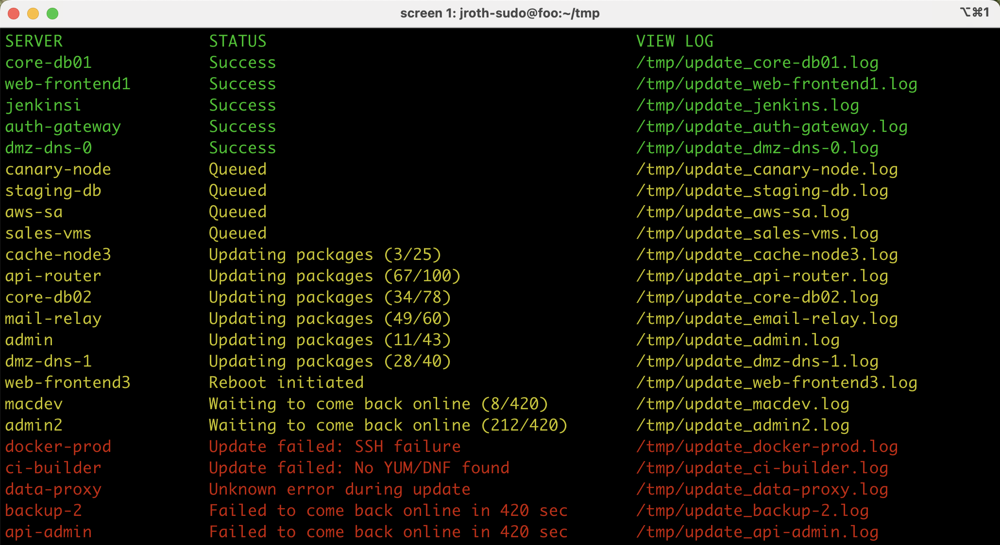

# patch-and-ping-dashboard

This simulated output shows the live dashboard view generated by `patch-and-ping` in Test Mode.

It demonstrates how the script tracks parallel updates, reboots, failures, and queued jobs in real time -- giving immediate visibility into what’s happening across a fleet of servers.

